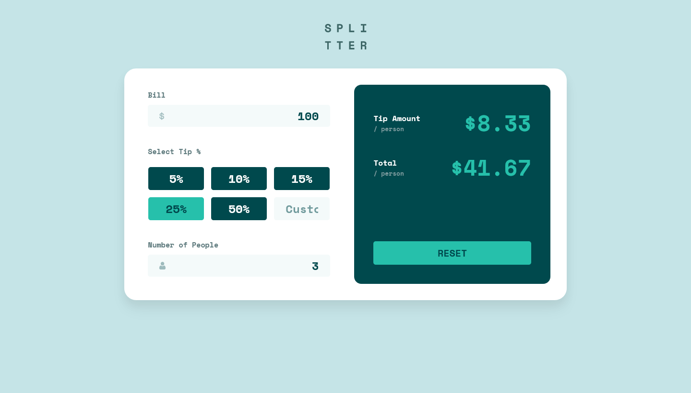

# Frontend Mentor - Tip calculator app solution

This is my solution for the [Tip calculator app challenge on Frontend Mentor](https://www.frontendmentor.io/challenges/tip-calculator-app-ugJNGbJUX). 

## Table of contents

- [Overview](#overview)
  - [The challenge](#the-challenge)
  - [Screenshot](#screenshot)
  - [Links](#links)
- [My process](#my-process)
  - [Built with](#built-with)
  - [What I learned](#what-i-learned)
  - [Continued development](#continued-development)
  - [Useful resources](#useful-resources)
- [Author](#author)
- [Acknowledgments](#acknowledgments)

**Note: Delete this note and update the table of contents based on what sections you keep.**

## Overview

### The challenge

Users should be able to:

- View the optimal layout for the app depending on their device's screen size
- See hover states for all interactive elements on the page
- Calculate the correct tip and total cost of the bill per person

### Screenshot

### Links

- Solution URL: [Add solution URL here](https://your-solution-url.com)
- Live Site URL: [Add live site URL here](https://your-live-site-url.com)

## My process

### Built with

- Semantic HTML5 markup
- CSS custom properties
- Flexbox
- Mobile-first workflow
- [Styled Components](https://styled-components.com/) - For styles

## Skills Learnt

- Develop an understanding of the deeper SCSS over CSS.
- Improve my basic knowledge on JavaScript and utlise some more advance methods within the language.
- Flexboxes within the SCSS and how to use them between mobile and desktop applications.

## Future Ways of Improving the Application

- Will look to transition the entire site to a REACT UI, removing any HTML but retaining majoreity of SCSS.
- Save results into a MongoDB for future records keeping.

## Author

- Author - [Matt Cutler]
- Frontend Mentor - [@B1u3C0w](https://www.frontendmentor.io/profile/B1u3C0w)

**Note: Delete this note and add/remove/edit lines above based on what links you'd like to share.**
